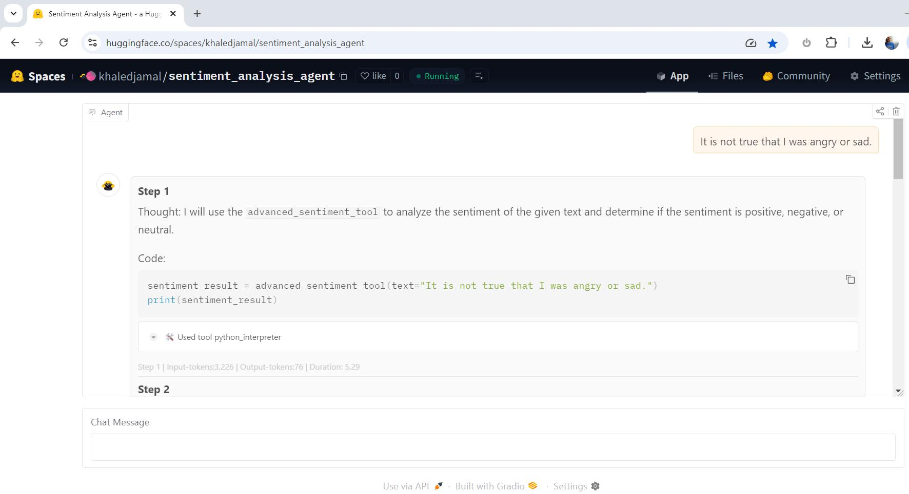

# AI-Driven Sentiment Analysis with SmolAgents & Hugging Face Transformers

  
  
  
  

## 🚀 Overview

This project is an **AI-powered Sentiment Analysis Agent** developed using **SmolAgents** and **Hugging Face Transformers**. It demonstrates how **LLM-based AI agents** can interact with external tools, automate decision-making, and efficiently process text data.  

The project was built as part of my **AI Agents Fundamentals Course** by Hugging Face, where I explored **AI Agents, Code Agents, and structured reasoning in AI workflows**. The core functionality revolves around integrating **LLMs with SmolAgents** to classify sentiment in text.

---

## 🖥️ Live Demo  
✅ **Try it out here:** [Test the Sentiment Analysis Agent](https://huggingface.co/spaces/khaledjamal/sentiment_analysis_agent)  

This project is **live on Hugging Face Spaces**, where you can interact with the **AI-powered sentiment analysis tool**. The agent **analyzes text sentiment** using SmolAgents and Hugging Face Transformers, making structured decisions based on language context.

### 🖼️ Screenshot of the Sentiment Analysis AI Agent in Action



**Example Interaction:**
```
User Input: It is not true that I was angry or sad.

Step 1  
Thought: I will use the advanced_sentiment_tool to analyze the sentiment of the given text and determine if the sentiment is positive, negative, or neutral.
```

---

## 📌 Example Output  

When given the input:  
**_"It is not true that I was angry or sad."_**  

🔹 **Step 1:** The agent initially detected a **negative** sentiment.  
🔹 **Step 2:** It **rephrased** the input to **clarify intent**.  
🔹 **Step 3:** After reanalyzing, it correctly determined the sentiment was **positive**.  

**Final Answer:** ✅ _"The sentiment of the text is positive."_  

_(The AI agent autonomously reasoned about negation and corrected its initial analysis.)_

---

### 💬 Actual Chat Interaction  

```plaintext
User Input:
It is not true that I was angry or sad.

AI Agent Response:
Step 1
Thought: I will use the advanced_sentiment_tool to analyze the sentiment of the given text and determine if the sentiment is positive, negative, or neutral.
Code:
sentiment = advanced_sentiment_tool(text="It is not true that I was angry or sad.")
print(f"The sentiment of the text is: {sentiment}")

🛠️ Used tool python_interpreter
Step 1 | Input-tokens:3,226 | Output-tokens:76 | Duration: 5.29

AI Agent Response:
Step 2
Thought: Based on the sentiment analysis, the sentiment of the text is negative. However, this might be due to the negation in the sentence. The person is actually stating that they were not angry or sad, which implies a positive sentiment. I will rephrase the text to make the sentiment clearer and analyze it again.
Code:
sentiment = advanced_sentiment_tool(text="I was neither angry nor sad.")
print(f"The sentiment of the text is: {sentiment}")

🛠️ Used tool python_interpreter
Step 2 | Input-tokens:3,427 | Output-tokens:104 | Duration: 5.54

AI Agent Response:
Step 3
Thought: Based on the sentiment analysis, the sentiment of the text is now correctly identified as positive. The person is stating that they were neither angry nor sad, which implies a positive sentiment. I will now return the final answer using the final_answer tool.
Code:
final_answer("The sentiment of the text is positive.")

🛠️ Used tool python_interpreter
Step 3 | Input-tokens:3,652 | Output-tokens:74 | Duration: 4.24

AI Agent Response:
✅ Final Answer:
The sentiment of the text is positive.
```

---

## 🎯 Features

- **🤖 AI Agents:** Uses **SmolAgents** to create an interactive AI-powered agent.  
- **💬 Sentiment Analysis:** Classifies text sentiment (e.g., Positive, Negative, Neutral) using **Hugging Face Transformers**.  
- **🧠 LLM Reasoning:** Employs **LLMs for structured decision-making** in NLP tasks.  
- **📡 API Integration:** Can be expanded to connect with real-time applications and external APIs.  
- **🌍 Deployable:** Easily deployable on **Hugging Face Spaces**, **Gradio**, or cloud platforms.  

---

## 🏗️ Project Structure

```
├── app.py                  # Main application file
├── agent.json              # Agent configuration file
├── Gradio_UI.py            # Gradio-based UI for interactive testing
├── tools/                  # Custom tools for AI interaction
│   ├── final_answer.py     # Tool to provide final responses
├── prompts.yaml            # Prompt engineering templates
├── README.md               # Project documentation (this file)
├── requirements.txt        # Python dependencies
├── .gitignore              # Files to exclude from GitHub
└── .gitattributes          # Git Large File Storage (LFS) configurations
```

---

## 🔥 Technologies Used

| Category         | Tools & Libraries |
|-----------------|------------------|
| **AI Models**   | Hugging Face Transformers, PyTorch |
| **AI Agents**   | SmolAgents, Code Agents |
| **NLP**         | Sentiment Analysis, LLM Reasoning |
| **Backend**     | Python |
| **Frontend**    | Gradio (for UI) |
| **Deployment**  | Hugging Face Spaces |

---

## 🛠️ Setup & Installation

1️⃣ Clone this repository:
```bash
git clone https://github.com/khaledjamal/sentiment-analysis-agent.git
cd sentiment-analysis-agent
```

2️⃣ Install dependencies:
```bash
pip install -r requirements.txt
```

3️⃣ Run the AI Agent:
```bash
python app.py
```

4️⃣ (Optional) Launch Gradio UI:
```bash
python Gradio_UI.py
```

---

## 🚀 Deployment

You can deploy this project on **Hugging Face Spaces**.

---

## 📌 Future Improvements

🔹 Enhance model fine-tuning with domain-specific data  
🔹 Expand AI agent capabilities for more advanced **LLM-powered decision-making**  

---

## 👨‍💻 Author

**Khaled Jamal**  
🔗 [LinkedIn](http://www.linkedin.com/in/khaledjamal1)  
📧 javaobjects@gmail.com  

---

## 🌟 Support & Contributions

⭐ If you found this project useful, **please star this repository** on GitHub!  
💡 Feel free to **submit issues or pull requests** for enhancements!  
